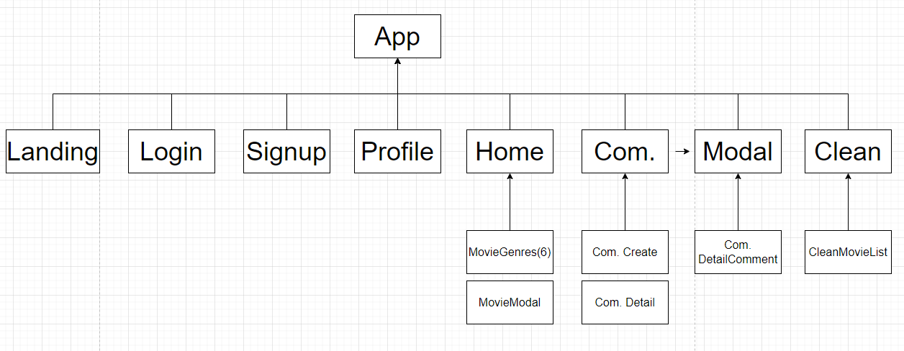
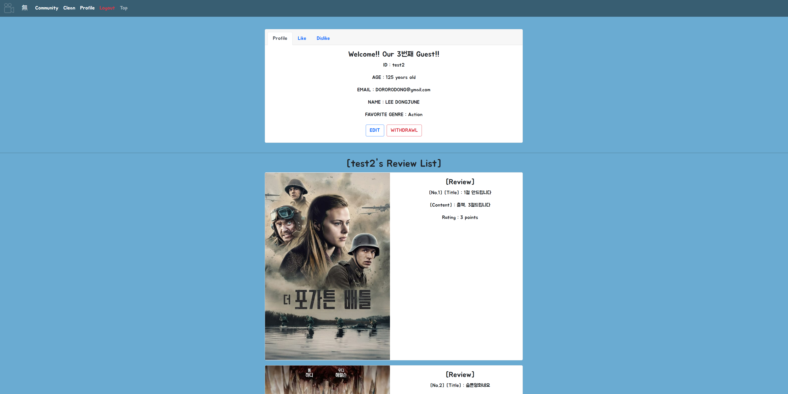

# 無비


by Tae Hun KIM, 

partnered with Dong Jun LEE


   

  

   

     

  

    

    


[[_TOC_]]


## 📂 Table of Contents

* **🗓 Date / 💻 Environment**
* **💦 Goal**
* **🎬 PJT_無비**
* **📃 Service Specification**
* **📚 Requirements**
* **🖥 Web_Image**
* **💬 Conclude about Final_PJT**


## 🗓 Date / 💻 Environment 

* **Start** Date : 2021년 11월 15일 (월) 10:00
* **Completion** Date : 2021년 11월 25일 (목) 18:00
* **Environment**
  * **사용 도구 : `Visual Studio Code`, `Chrome Browser`**
  * **사용 언어 : `Python 3.9.6`, `Django 3.2.9`, `Node.js LTS 16.13.0`, `Vue.js 2.X`**
  * **사용 라이브러리 : `Vue-cli 4.5.15`, `vue-router`**
  * **아키텍처 : `Django REST API Server` & `Vue.js`**


## 💦 Goal

* **영화 정보 기반 추천 서비스 구성**
* **커뮤니티 서비스 구성**
* **`HTML`, `CSS`, `JavaScript`, `Vue.js`, `Django`, `REST API`, `DataBase` 등을 활용한 실제 서비스 설계**
* 서비스 관리 및 유지보수


## 🎬 PJT_無비

### 1. 컨셉

- **🈚 [없을 무]** 

코로나 시국, 요즘엔 주말에 영화를 보기위해 영화관을 가기보단 핸드폰을 키고 넷플릭스, 왓챠 등의 어플을 키고 영화를 고릅니다.

많은 직장인 혹은 귀차니즘이 강한 남성분들은 (특히 나...) 영화를 고르다가 너무 많은 선택지 때문에 종종 어플을 끄고 그냥 잠이나 자는데...

**이런 귀차니즘을 해결하면서도 심플한 디자인으로 어지럽지 않게 고객에게 다가가기 위해 많은 부분을 처내고 남는 부분이 거의 없는 컨셉으로 웹을 구성했기에, 서비스 이름을 없을 무 [🈚]라고 지었습니다!**

---


### 2. 팀원 정보 및 업무 분담 내역

|   범위    | 프레임워크 |      정/부      |
| :-------: | :--------: | :-------------: |
| Front-End |   Vue.js   | 김태훈 / 이동준 |
| Back-End  |   Django   | 이동준 / 김태훈 |

---


### 3. 데이터베이스 모델링 (ERD)


---


### 4. 컴포넌트 구조



---


### 5. 목표 서비스

```python
# 1. 영화 조회 서비스
- 전체 영화 조회
- 영화 상세 조회
- 장르별 영화 조회

# 2. 영화 추천 서비스
- clean(無) 모드 구현 : 유저가 좋아하는 장르를 기반으로 딱 3개만 추천

# 3. 커뮤니티 기능
- 영화 리뷰 작성/조회/수정/삭제
- 댓글 작성/삭제

# 4. 랜딩 페이지 구현
- 입장 페이지 구현

# 5. 프로필
- 개인 프로필 조회

# 6. 기타
- 위로 바로 이동 기능
```

---


### 6. 배포 서버 URL

- `Front-End` : `Netlify`로 추후 진행 예정
- `Back-End` : `AWS` or `Heroku`로 추후 진행 예정

---


### 7. 미비된 점 (부족했거나 아쉬웠다고 생각하는 점)

```python
# [B.E.]
1-1. 첫술에 배부를 순 없겠지만, ERD 작성에 공을 들여도 실제로 Django models.py를 설정할 땐 여전히 관계가 많이 헷갈렸다.
1-2. 관련하여 주석을 다 달고 시간에 쫓겨 이해되지 않은 부분은 넘어갔으나, F.E.와 연동하면서 오류가 뜨니 재설정 해줘야 하는 경우가 종종 있었다. [models.py 뿐만 아니라 urls.py + views.py + serializers.py 까지 모두...]


# [F.E.]
1. 점점 더 많은 Componet들이 생기고 마치 ERD마냥 관계를 고려해줘야 하다보니 Community부분에서는 살짝 우리들만 알아볼 수 있는 구조와 파일명들이 조금 생겼는데, 더 많은 사람들과 현업할 때는 위험한 과정일 수 있으니 다음번에는 교훈삼아 조금 돌아가더라도 정확한 구조와 명칭을 사용해야겠다!


# 협업툴
1-1. Gitlab(or Github)를 이용해서 코드를 공유하는 것은 초반에 하다가, 비효율적이어서 더 시도 해보지 않았다... 마치, 방법은 익히고 문제는 안푼 듯한?
1-2. Slack이라는 좋은 소통창구가 있어서, 대화는 물론 코드도 자유롭게 주고 받으며 서로 작성한 코드를 주고 받았다. [분업이 잘 되어 있어서 충돌이 거의 일어나지 않았다! 오히려 좋아?]
1-3. Branch의 개념에 대해서 따로 혹은 같이 알아보았는데, 다음 PJT 때부터는 현업환경처럼 적극적으로 시도해봐야겠다!


# [기타 (전반적으로 시간부족!)]
1. 좀 더 다양한 추천 알고리즘을 구현해볼 시간이 부족했다... (기능 구현에 초점을 좀 더 맞추다보니)
2. 여태까지 배운것과 TMDB API를 바탕으로 하면 좀 더 많은 기능을 구현해 볼 수 있었을 것 같은데...(좋아요/싫어요/팔로우/영화배우/평점기반 등)

```

---


## 📃 Service Specification

### A. 데이터 수집

- **Requirements**

  - **본 프로젝트는 `영화`를 주제로 진행되기 때문에, `영화 정보 데이터베이스`를 필수적으로 가지고 있어야 함**
  - 데이터를 수집하는 방법은 제한없이 자유롭게 진행

  * 영화 데이터 수집 예시는 하기와 같음
    * 영화 진흥 위원회
    * 네이버 검색 API (영화)
    * **The Movie Database (TMDB)**


  * 최초에 각 팀 별로 등록된 영화 레코드(record)는 최소 50개 이상을 유지해야 함


* **관련 설명 (`Requirements_B. 영화 정보 [참고] `)**
  *  많은 양의 정보를 DB에 담고자 API 명세를 읽기 편한 `TMDB`를 이용하기로 결정


---

### B. 프로젝트 구조

- **Requirements**
  - **모바일 대응을 위한 `반응형 웹`, `Django REST API 서버` 및 `프론트엔드 프레임워크 (Vue.js)` 분리 등의 상세 구현 방식은 자유롭게 구성하되, 프로젝트 README.md  상단에 `프로젝트 구조에 대한 설명`을 반드시 명시**


* **구조[F.E.] (`PJT_無비_4. 컴포넌트 구조 [참고] `) / .env.local(코드)**


```
# .env.local
VUE_APP_SERVER_URL = http://127.0.0.1:8000

변수로 설정해줘서 이것을 계속 이용 [Client에서 Server로 신호요청시 계속 이용]
```


- **구조[B.E.]  + models.py**


```python
# accounts
from django.db import models
from django.contrib.auth.models import AbstractUser

class User(AbstractUser):
    # 11/21 유저 필드에 정보 채워넣어주기 위해 수정
    age = models.IntegerField(default=10)
    preference = models.IntegerField(default=28)
    
------------------------------------------------------------------------------------------------------------
# community
from django.db import models
from django.conf import settings
from movies.models import Movie

class Review(models.Model):
    RATING = [
        (1, '★'),
        (2, '★★'),
        (3, '★★★'),
        (4, '★★★★'),
        (5, '★★★★★'),
    ]
    title = models.CharField(max_length=100)                                                                    # 리뷰글 제목
    rating = models.IntegerField(choices=RATING, default=5)                                                      # 평점
    content = models.TextField()                                                                                # 리뷰글 내용
    created_at = models.DateTimeField(auto_now_add=True)                                                        # 리뷰글 생성
    updated_at = models.DateTimeField(auto_now=True)                                                            # 리뷰글 수정
    movie = models.ForeignKey(Movie, on_delete=models.CASCADE, related_name='movie_reviews')                    # 영화(1) : 리뷰글(N)
    user = models.ForeignKey(settings.AUTH_USER_MODEL, on_delete=models.CASCADE, related_name='user_reviews')   # 유저(1) : 리뷰글(N)

    def __str__(self):
        return self.title


class Comment(models.Model):
    content = models.CharField(max_length=100)                                                                   # 댓글 내용
    review = models.ForeignKey(Review, on_delete=models.CASCADE, related_name='review_comments')                 # 리뷰글(1) : 댓글(N)
    user = models.ForeignKey(settings.AUTH_USER_MODEL, on_delete=models.CASCADE, related_name='user_comments')   # 유저(1) : 댓글(N)

    def __str__(self):
        return self.content
    
------------------------------------------------------------------------------------------------------------ 
# movies
from django.db import models
from django.conf import settings
from django.core.validators import MaxValueValidator, MinValueValidator

class Genre(models.Model):
    name = models.TextField()                                                                           # 장르 이름
    like = models.ManyToManyField(settings.AUTH_USER_MODEL, related_name='user_like_genres')            # 유저가 좋아하는 장르

    def __str__(self):
        return self.name


class Movie(models.Model):
    title = models.TextField()                                                                          # 제목
    original_title = models.TextField()                                                                 # 원래 제목 (영어)
    overview = models.TextField()                                                                       # 줄거리
    poster_path = models.TextField()                                                                    # 포스터
    genres = models.ManyToManyField(Genre)                                                              # 장르
    release_date = models.DateField()                                                                   # 개봉일
    adult = models.BooleanField()                                                                       # 청불
    popularity = models.FloatField(validators=[MinValueValidator(0)])                                   # 인기도
    runtime = models.IntegerField(validators=[MinValueValidator(0)])                                    # 상영시간
    vote_average = models.FloatField(validators=[MinValueValidator(0), MaxValueValidator(10)])          # 평점
    vote_count = models.IntegerField(validators=[MinValueValidator(0)])                                 # 투표수
    like = models.ManyToManyField(settings.AUTH_USER_MODEL, related_name='like_movies')            # 유저가 좋아요
    dislike = models.ManyToManyField(settings.AUTH_USER_MODEL, related_name='dislike_movies')      # 유저가 싫어요

    def __str__(self):
        return self.original_title
    
```


* **관련 설명**
  
  
  * `accounts` : User 관련 DB
  * `community` : Review와 Comment 관련 DB
  * `movies` : Movie 와 Genre 관련 DB [추천 알고리즘을 위해 Genre는 따로 지정]
  
  

---

### C. 커뮤니티 기능

* **Requirements**
  *  **영화 `커뮤니티`에 필요한 기능을 구성**
  


* **관련 설명 (`Requirements_D. 커뮤니티 [참고] `)**
  *  영화 리뷰 작성/조회/수정/삭제 구현
  *  리뷰 댓글 작성/삭제 구현

 

---

### D. 추천 서비스 기능

* **Requirements**
  * **사용자에게 제공되는 `영화 추천` 방식은 자유롭게 구성하되 해당 서비스를 이용하는 사용자는 반드시 영화를 추천 받을 수 있어야 함**


* **관련 설명 (`Requirements_C. 추천 알고리즘 [참고] `)**
  *  회원가입시에 선호하는 장르를 `default`를 통해 필수적으로 입력하게 함
  *  User가 `Navbar`의 `Clean`을 클릭하면 선호하는 장르에서 Random하게 3개의 영화를 추천


---

### E. 디자인

* **Requirements**
  * **최소한의 HTML/CSS를 통해 웹 사이트를 `디자인` 해야함**


* **관련 설명 (`Web_Image [참고] `)**
  *  기본적인 기능 구현 후, `Interactive`한 요소를 가능한한 많이 적용 


---

## 📚 Requirements (필수 기능 설명)

- **아래의 세부 요구사항은 필수 기능으로 프로젝트 내에 반드시 포함**
- 이 외의 추가적인 기능 및 디자인 등은 팀 별로 자유롭게 수행


###  A. 관리자 뷰

- **Requirements**
  - 관리자 권한의 유저만 영화 등록/수정/삭제 권한을 가짐
  - 관리자 권한의 유저만 유저 관리 권한을 가짐
  - 장고에서 기본적으로 제공하는 admin 기능을 이용하여 구현
  - Vue.js를 활용하는 경우에도 Django admin기능을 이용하여 구현


- **코드(admin.py) / 사진**

```python
# accounts
from django.contrib import admin
from .models import User

admin.site.register(User)

# community
from django.contrib import admin
from .models import Review, Comment

admin.site.register(Review)
admin.site.register(Comment)

# movies
from django.contrib import admin
from .models import Genre, Movie

admin.site.register(Genre)
admin.site.register(Movie)

```


* **관련 설명**
  * 관리자 권한의 유저만 유저 관리 권한을 가짐
  * 가입 후 게시글/댓글 등에 대한 작성/삭제/수정 등의 행위를 하면 최근활동에 기록이 남음


---

### B. 영화 정보

- **Requirements**
  - 영화 정보는 Database Seeding을 활용하여 최소 50개 이상의 데이터가 존재하도록 구성
  - 모든 로그인 된 유저는 영화에 대한 평점 등록/수정/삭제 등을 할 수 있어야 함


- **사진 / 코드(get_data.py)**


```python
import urllib.request
import json

api_key = '발급받은 API KEY'
API_KEY = f"{api_key}"

HOST = "https://api.themoviedb.org"
MOVIE_LIST_URI = "/3/movie/popular"
MOVIE_INFO_URI = "/3/movie/"
GENRE_LIST_URI = "/3/genre/movie/list"

movie_list = []
movie_Ids = []
genre_list = []

genre_request = (f'{HOST}{GENRE_LIST_URI}?api_key={API_KEY}&language=ko')
response = urllib.request.urlopen(genre_request)
json_str = response.read().decode('utf-8')
json_object = json.loads(json_str)

genre_data = json_object.get("genres")
for data in genre_data:
    my_data = {
        "number": data.get("id"),
        "name": data.get("name")
    }
    my_genre = {
        "model": "movies.genre",
        "pk": my_data.get("number"),
        "fields": {
            "name": my_data.get("name")
        },
    }
    genre_list.append(my_genre)


for i in range(1, 15):
    request = (f'{HOST}{MOVIE_LIST_URI}?api_key={API_KEY}&language=ko&page={i}')
    response = urllib.request.urlopen(request)
    json_str = response.read().decode('utf-8')
    json_object = json.loads(json_str)

    data_movies = (json_object.get("results"))

    for movie in data_movies:
        movie_Ids.append(movie.get("id"))


for idx, movie_Id in enumerate(movie_Ids):
    movie_request = (f'{HOST}{MOVIE_INFO_URI}{movie_Id}?api_key={API_KEY}&language=ko&')
    response = urllib.request.urlopen(movie_request)
    json_str = response.read().decode('utf-8')
    json_object = json.loads(json_str)

    if json_object.get("poster_path"):
        if json_object.get("genres"):

            my_object = {
                "model": "movies.movie",
                "pk": idx+1,
                "fields": {
                    "title": json_object.get("title"),
                    "adult": json_object.get("adult"),
                    "popularity": json_object.get("popularity"),
                    "poster_path": json_object.get("poster_path"),
                    "release_date": json_object.get("release_date"),
                    "runtime": json_object.get("runtime"),
                    "vote_average": json_object.get("vote_average"),
                    "vote_count": json_object.get("vote_count"),
                    "overview": json_object.get("overview"),
                    "genres": [json_object.get("genres")[0].get("id")],
                    "original_title": json_object.get("original_title"),
                }  
            }
        movie_list.append(my_object)
        

with open('movies.json', 'w', encoding='UTF-8') as file:
    file.write(json.dumps(movie_list, indent=4, ensure_ascii=False))

with open('genres.json', 'w', encoding='UTF-8') as file:
    file.write(json.dumps(genre_list, indent=4, ensure_ascii=False))
```


* **관련 설명**

  * ```python
    # 명령어
    $ python manage.py loaddata movies/fixtures/genres.json
    $ python manage.py loaddata movies/fixtures/movies.json
    ```

  * `TMDB API` 이용 / `JSON`파일로 저장 : 장르 19개 / 영화 280개

  * 장르의 경우는 숫자로 되어 있어서 그에 따른 정보를 먼저 불러와야 했음

  * `TMDB_DATA`에 생성된 파일들을 `Django`에서 이용하기 위하여 `fixtures`라는 폴더를 만들어서 담아서 이용 (DB에 저장)


---

### C. 추천 알고리즘

- **Requirements**
  - 평점을 등록한 유저는 해당 정보를 기반으로 영화를 추천 받을 수 있어야 함
  - 추천 알고리즘의 지정된 형식은 없으나, 사용자는 반드시 최소 1개 이상의 방식으로 영화를 추천 받을 수 있어야 함
  - 추천 방식은 각 팀별로 자유롭게 선택할 수 있으며 어떠한 방식으로 추천 시스템을 구성했는지 설명할 수 있어야 함


- **코드 (Clean.vue)**

```vue
<template>
  <div class="wow" v-if="!detailOn">
    <div class="container">
      <clean-movie-list v-for="(movie, idx) in randomlyPickedMovies" :key="idx" :movie="movie"></clean-movie-list>
    </div>
  </div>
</template>
  
<script>
import CleanMovieList from '@/components/CleanMovieList'
import _ from "lodash"

import axios from 'axios'
import jwt_decode from "jwt-decode"

export default {
  name: 'Clean',
  components: {
    CleanMovieList,
  },
  data: function () {
    return {
      currentUserId: '',
      currentUserName: '',
      preference: '',
      userInfo: [],
      userMovies: [],
      randomlyPickedMovies: [],
      detailOn: false,
    }
  },
  methods: {
    
    randomPick: function () {
      this.randomlyPickedMovies = _.sampleSize(this.userMovies, 3)
      console.log(this.randomlyPickedMovies)
    },
    
    // 먼저 영화 리스트 다 받아오고,
    getPreference: function () {
      const SERVER_URL = process.env.VUE_APP_SERVER_URL

      axios({
        method: 'get',
        url: `${SERVER_URL}/movies/`,
        headers: this.setToken()
        // params,
      })
      .then((res) => {
        let movies = res.data
        this.userMovies = movies.filter(movie => {
          // 범죄, 호러, 미스터리, 스릴러 장르 삽입
          if (movie.genres.includes(this.preference)) {
            return true
          }
        })
        this.randomPick()
      })
      .catch((err) => {
        console.log(err)
      })
    },

    setToken: function () {
      const token = localStorage.getItem('jwt')
      const config = {
        Authorization: `JWT ${token}`
      }
      return config
    },
  },
  created: function () {
    // 유저 정보 가져오고
    const SERVER_URL = process.env.VUE_APP_SERVER_URL
    const token = localStorage.getItem('jwt')
    const decoded = jwt_decode(token)
    this.currentUserName = decoded.username
    this.currentUserId = decoded.user_id

    axios({      
      method: 'get',
      url: `${SERVER_URL}/accounts/${this.currentUserName}/`,
      headers: this.setToken()
    })
    .then((res) => {
      if (res.data.id === this.currentUserId) {   // 현재 유저가 맞는지 1차 확인
        this.userInfo = res.data
        this.preference = res.data.preference
        this.getPreference()
      } else {
        console.log('수작 부리지 말거라..')
      }
    })
    .catch((err) => {
      console.log(err)
    })
  }
}
</script>

<style scoped>
.wow {
  width: 100%;
  height: 80vh;
  
  display:grid;
  place-items:center;
}

.container {
  display:flex;
  justify-content:center;
  align-items:center;
  gap:40px;
  
}
.container:hover .clean-img {
  opacity:0.3;
}

</style>
```


* **관련 설명**
  * `randomPick` : 영화를 **랜덤**하게 **3개**를 선택 (우리의 **Clean[無]** 컨셉에 맞게 딱 3개만 가져오기로 함)
  * `getPreference` : 영화 Data 중 회원가입 시에 **선호하는 장르**만 **filtering**함


---

### D. 커뮤니티

- **Requirements**
  - 영화 정보와 관련된 대화를 할 수 있는 커뮤니티 기능을 구현
  - 로그인한 사용자만 글을 조회/생성할 수 있으며 작성자 본인만 글을 수정/삭제 할 수 있음
  - 사용자는 작성된 게시 글에 댓글을 작성할 수 있어야 하며, 작성자 본인만 댓글을 삭제할 수 있음
  - 각 게시글 및 댓글은 생성 및 수정 시각 정보가 포함


- **코드 (Modal.vue / CommunityDetailComment.vue)**

```vue
<template>
  <div>
    <div v-if="doUpdate"><!-- 리뷰 글 업데이트 컴포넌트 -->
      <div class="wow">
        <form action="/home">
          <div class="card container" style="width: 18rem;">
            <div class="card-body">
              <h5 class="card-title"><label for="title">[Title]</label></h5>
              <h5><input v-model.trim="newTitle" id="title" type="text" :placeholder="detail.title"/></h5>
              <hr>
              <h5 class="card-subtitle mb-2">[Content]</h5>
              <h5><input v-model.trim="newContent" id="content" type="text" :placeholder="detail.content"/></h5>
              <hr>
              <h6>[Rating]</h6>
              <h6><input v-model.trim="newRating" id="rating" type="number" :placeholder="detail.rating"/></h6>
              <hr>
              <button type="button" class="btn btn-outline-success m-2" @click="updateReview">OK</button>
              <button type="button" class="btn btn-outline-success m-2" @click="backToDetail">Cancel</button>
            </div>
          </div>
        </form> 
      </div>
    </div>

    <div v-else><!-- 리뷰 글 내용 컴포넌트 -->
      <b-row cols="3"><!-- 영화 포스터 -->
      <b-col></b-col>
        <b-col>
          <h2>[{{ original_title }}]</h2>
            <b-card no-body class="overflow-hidden mb-3">
              <b-row>
                <b-col md="6">
                  <b-card-img :src="`https://image.tmdb.org/t/p/w500${this.poster_path}`" alt="movie image" class="rounded-0"></b-card-img>
                </b-col>
                 
                <b-col md="6">
                  
                  <b-card-body title="[Review]">
                    <b-card-text>[Title] : {{ detail.title }}</b-card-text>
                    
                    <b-card-text>[Content] : {{ detail.content }}</b-card-text>
                    
                    <b-card-text>Written By : {{ detail.username }}</b-card-text>
                    
                    <b-card-text>Rating : {{ detail.rating }} points</b-card-text>
                    
                    <span v-if="isAuthor">
                      <b-button class="m-1" @click="updateMode" variant="outline-primary">EDIT</b-button>
                      <b-button class="m-1" @click="deleteReview" variant="outline-danger">DELETE</b-button>
                    </span>
                    <span>  
                      <b-button class="m-1" @click="backToReview" variant="outline-success">BACK</b-button>
                    </span>
                  </b-card-body>
                 
                </b-col>
                 
              </b-row>
            </b-card>
        </b-col>     
      </b-row>
      <hr>
      <community-detail-comment :isAuthor="isAuthor" :reviewPk="this.$route.params.review_pk"></community-detail-comment>
    </div>
  </div>

</template>

<script>

import CommunityDetailComment from '@/components/CommunityDetailComment'

import axios from 'axios'
import jwt_decode from "jwt-decode"

export default {
  name: 'Modal',
  components: {
    CommunityDetailComment,
  },
  data: function () {
    return {
      detail: [],
      doUpdate: false,
      newContent: '',
      newTitle: '',
      newRating: '',
      isAuthor: false,
      poster_path: '',
      original_title: '',
    }
  },
  methods: {

    backToDetail: function() {
      this.doUpdate = false
    },
    
    backToReview: function () {
      this.$emit('back-to-review')
    },

    setToken: function () {     // 유저의 토큰 가져옴
        const token = localStorage.getItem('jwt')
        const config = {
          Authorization: `JWT ${token}`
        }
        return config
      },

    updateMode: function () {   // 수정 창 띄우기 위한 상태정보 전환
      this.doUpdate = true
    },

    updateReview: function () {
      const SERVER_URL = process.env.VUE_APP_SERVER_URL
      const movie_pk = this.$route.params.movie_pk
      const review_pk = this.$route.params.review_pk

      axios({
          method: 'put',
          url: `${SERVER_URL}/community/movies/${movie_pk}/reviews/${review_pk}/`,
          headers: this.setToken(),
          data: {
            title: this.newTitle,
            content: this.newContent,
            rating: this.newRating, 
          },
        })
        .then((res) => {
          this.detail = res.data
          this.doUpdate = false
          this.newTitle = ''
          this.newContent = ''
          this.newRating = ''
        })
        .catch((err) => {
          console.log(err)
        })
    },

    deleteReview: function () {
      const SERVER_URL = process.env.VUE_APP_SERVER_URL
      const movie_pk = this.$route.params.movie_pk
      const review_pk = this.$route.params.review_pk

      axios({
          method: 'delete',
          url: `${SERVER_URL}/community/movies/${movie_pk}/reviews/${review_pk}/`,
          headers: this.setToken(),

        })
        .then((res) => {
          console.log(res.data)
          this.newTitle = ''
          this.newContent = ''
          this.newRating = ''
          this.$emit('delete-review')
        })
        .catch((err) => {
          console.log(err)
        })
      
    }
  },

  created: function () {    // 상세보기 페이지 생성 시 자동으로 영화 상세정보 가져옴

    const SERVER_URL = process.env.VUE_APP_SERVER_URL
    const movie_pk = this.$route.params.movie_pk
    const review_pk = this.$route.params.review_pk

    axios({
        method: 'get',
        url: `${SERVER_URL}/community/movies/${movie_pk}/reviews/${review_pk}/`,
        headers: this.setToken()
        // params,
      })
      .then((res) => {
        // console.log(res.data)
        this.detail = res.data

        const token = localStorage.getItem('jwt')
        const decoded = jwt_decode(token)
        if (decoded.username === this.detail.username) {    // 로그인 유저와 작성 유저 이름 동일해야
          this.isAuthor = true                              // 리뷰 글 수정버튼 보여줌
        }
      })
      .catch((err) => {
        console.log(err)
      })

    axios({       // 영화 포스터 가져오기위한 낫떔질..
        method: 'get',
        url: `${SERVER_URL}/movies/movies/${movie_pk}/`,
        headers: this.setToken()
        // params,
      })
      .then((res) => {
        this.poster_path = res.data.poster_path
        this.original_title = res.data.original_title
      })
      .catch((err) => {
        console.log(err)
      })
  }
}


</script>

<style scoped>
.wow {
  width: 100%;
  height: 80vh;
  
  display:grid;
  place-items:center;
}

.rightequal {
  display: flex;
  flex-wrap: nowrap;
  flex-direction: column;
  justify-content: space-between;
}
</style>

```

```vue
<template>
  <div>
    
    <div> <!-- 코멘트 작성 란 -->
      <label for="content" class="fs-2">Write a comment</label>
      <br>
      <input type="floatingTextarea" id="content" name="content" v-model.trim="commentContent" @keypress.enter="saveComment">
      <button type="button" class="btn btn-outline-dark m-2" @click="saveComment">OK</button>

      <hr>

      <h2 class="mb-4">[Comments List]</h2> <!-- 코멘트 표시 란-->
      <div id="comments" v-for="(comment, idx) in comments.slice().reverse()" :key="idx">
        <div v-if="comment.review === reviewPk"> <!-- 해당 리뷰에 속한 코멘트만 표시 -->
          <b-row cols="3"><!-- 영화 포스터 -->
            <b-col></b-col>
            <b-col>
              <div class="mt-4">
                <span>Written By : {{ comment.username }}</span>
                <button v-if="comment.username === currentUser" type="button" class="btn btn-outline-danger m-2" @click="deleteComment(comment)">X</button> <!-- 댓글 삭제 버튼 --><!--본인일때만 수정 가능-->
                <b-card img-src="https://placekitten.com/300/300" img-alt="Card image" img-left class="my-2">
                  <b-card-text>{{ comment.content }}</b-card-text>
                </b-card>  
              </div>
            </b-col>
          </b-row>  
        </div>
      </div>
    </div>

  </div>
</template>

<script>

import axios from 'axios'
import jwt_decode from "jwt-decode"

export default {
  name: 'CommunityDetailComment',
  props: {
    isAuthor: Boolean,
    reviewPk: Number,
  },
  data: function () {
    return {
      currentUser: '',
      commentContent: '',
      comments: [],
    }
  },

  methods: {

    getComments: function () {

      const token = localStorage.getItem('jwt')
      const decoded = jwt_decode(token)
      this.currentUser = decoded.username

      const SERVER_URL = process.env.VUE_APP_SERVER_URL
      
      this.comments = []    // 중복 내용 방지위해 매번 불러올때마다 comments 초기화
      
      axios({
          method: 'get',
          url: `${SERVER_URL}/community/reviews/${this.reviewPk}/comments/`,
          headers: this.setToken(),
        })
        .then((res) => {
          // comments 리스트에 새로운 댓글 있으면 append
          for (var temp of res.data) {
            this.comments.push(temp)
          }
        })
        .catch((err) => {
          console.log(err)
        })
    },
    saveComment: function () {
      const SERVER_URL = process.env.VUE_APP_SERVER_URL
      const token = localStorage.getItem('jwt')
      const decoded = jwt_decode(token)

      axios({                   // 1. 입력된 댓글 DB에 저장
          method: 'post',
          url: `${SERVER_URL}/community/reviews/${this.reviewPk}/comments/`,
          headers: this.setToken(),
          data: {
            review: this.reviewPk,
            user: decoded.id,
            content: this.commentContent,
          },
        })
        .then((res) => {        // 2. DB에서 댓글들 불러옴
          console.log(res)
          this.getComments()
        })
        .catch((err) => {
          console.log(err)
        })
      this.commentContent = ''  
    },
    deleteComment: function (comment) {
      
      const SERVER_URL = process.env.VUE_APP_SERVER_URL

      axios({
          method: 'delete',
          url: `${SERVER_URL}/community/reviews/${this.reviewPk}/comments/${comment.id}/`,
          headers: this.setToken(),
        })
        .then((res) => {
          console.log(res)
          this.getComments()
        })
        .catch((err) => {
          console.log(err)
        })
    },

    setToken: function () {     // 유저의 토큰 가져옴
        const token = localStorage.getItem('jwt')
        const config = {
          Authorization: `JWT ${token}`
        }
        return config
      },
  },
  created: function () {    // 컴포넌트 생성 시 리뷰 정보들 가져오기
    this.getComments()
  }

}
</script>

<style>

</style>
```


* **관련 설명**
  
  * 로그인한 사용자만 글을 조회/생성할 수 있음
    * `const token = localStorage.getItem('jwt') / const decoded = jwt_decode(token)` : jwt를 이용해서 User 로그인을 진행하기 때문에, User 확인을 할 때도 jwt decode로 해독하고 확인하는 과정이 필요
  
  
  
  * 작성자 본인만 글을 수정/삭제 할 수 있음
    * `if (decoded.username === this.detail.username) { this.isAuthor = true }` : User 정보 일치여부 확인, 변수를 통한 구별 (`true / false`)
    * `v-if="doUpdate"` : 수정 버튼을 누르면 해당 변수가 변하면서 화면이 바뀜 (`true / false`)
  
  
  
  * 사용자는 작성된 게시 글에 댓글을 작성할 수 있음
    * `const token = localStorage.getItem('jwt') / const decoded = jwt_decode(token)` : jwt를 이용해서 User 로그인을 진행하기 때문에, User 확인을 할 때도 jwt decode로 해독하고 확인하는 과정이 필요
  
  
  
  * 작성자 본인만 댓글을 삭제할 수 있음
    * `v-if="comment.username === currentUser"` : 변수 이용, User 일치 여부 확인


---

### E. 기타

- **Requirements**
  - 최소한 5개 이상의 URL 및 페이지를 구성
  - HTTP Method와 상태 코드는 상황에 맞게 적절하게 반환되어야 하며, 필요에 따라 메시지 프레임워크 등을 사용하여 에러 페이지를 구성
  - 필요한 경우 Ajax를 활용한 비동기 요청을 통해 사용자 경험을 향상


- **코드 (router.index.js)**

```js
import Vue from 'vue'
import VueRouter from 'vue-router'
import Login from '@/views/accounts/Login'
import Signup from '@/views/accounts/Signup'
import Profile from '@/views/accounts/Profile'
import Home from '@/views/movies/Home'
import Community from '@/views/community/Community'
import Modal from '@/views/Modal'
import Clean from '@/views/Clean'
import Landing from '@/views/Landing'


Vue.use(VueRouter)

const routes = [
  {
    path: '/login',
    name: 'Login',
    component: Login
  },
  {
    path: '/signup',
    name: 'Signup',
    component: Signup
  },
  {
    path: '/profile',
    name: 'Profile',
    component: Profile
  },
  {
    path: '/home',
    name: 'Home',
    component: Home
  },
  {
    path: '/community',
    name: 'Community',
    component: Community
  },
  {
    path: '/modal',
    name: 'Modal',
    component: Modal,
  },
  {
    path: '/clean',
    name: 'Clean',
    component: Clean,
  },
  {
    path: '/landing',
    name: 'Landing',
    component: Landing,
  },
]

const router = new VueRouter({
  mode: 'history',
  base: process.env.BASE_URL,
  routes
})

export default router
```


* **관련 설명**
  * `Vue router` 라이브러리를 통해 `Single Page Application` 구현 (기본 `url`들을 지정)
  * 작업 중 수시로 `Postman`을 통해 HTTP Method와 상태 코드는 상황에 맞게 적절하게 반환되었는지 확인 **完 [+ `AJAX`(`axios`)]**


---

### F. 추가 구현 / 기능

- `Swagger` (사진)
  - API 문서를 자동화하여 F.E. / B.E. 양쪽에서 서로 확인 및 이용이 편리하게 하기 위해서 `Swagger`를 적용


---

## 🖥 Web_Image (실제 구현 정도)

- **총평**

```python
처음에는 필수적인 기능이 많다고 느껴 최대한 보노보노식으로 구현만 하고 추가적인 기능을 더 넣기로 의견을 모았는데, 중후반부엔 부가적인 기능을 하기보단 User가 보는 부분도 중요하다고 느껴 정적인 구성 뿐만 아니라 Interactive하게 동적인 요소들을 최대한 넣어 보았다! [Glide, perspective, rotate, transition, opacity, fadein, fadeindown 등]
```


- **초기 접속**


- **로그인 / 회원가입**


- **영화 전체 조회[메인 페이지] (장르별 영화 표시 가능)**

  영호 포스터에 마우스를 `hover` 하여 영화 상세정보 보기 가능 (`detail` 버튼 클릭).


- **영화 상세정보**

  `Create Review` 버튼 클릭으로 해당 영화에 대한 리뷰글 작성 가능


- **프로필 (본인이 작성한 리뷰글 표시)**




- **리뷰글 전체 조회**

  글라이드 기능을 추가함으로서 좌, 우측으로 스와이프 가능


- **리뷰글 상세 조회 (댓글 작성 가능)** 


- **Clean 모드 (추천 알고리즘)**

  `Lodash` 라이브러리를 활용하여 유저의 선호장르를 기반으로 3개의 동일 장르 영화를 무작위 추천.


---

## 💬 Conclude about Final_PJT

### 김태훈

---

```python
# 소통의 중요성 (Agile 방법론)
처음으로 혼자가 아닌 팀원과 함께 10일간 길고도 짧은 개발을 경험하며 소통의 중요성을 몸소 경험했습니다.
Agile 개발 방법론을 따라, 매일 2번의 스크럼을 진행하고 팀원과 잦은 미팅을 하며 끊임없는 소통을 해나갔습니다. 이 과정에서 몇 번이고 빠르게 미스 커뮤니케이션을 바로잡아 최대한 일관된 개발 진행 방향을 유지할 수 있었습니다. 덕분에 촉박한 시간에도 프로젝트를 마무리할 수 있었고, 남은 시간을 활용해 responsive 한 디자인 요소들도 넣어, 결과물을 한층 더 고급스럽게 표현할 수 있었습니다.
위 내용들은 전부 정론일 뿐이고, 속내는, 소통을 많이 할 수록 팀원과 친해질 수 있기에 agile 방법론이 즐겁게 다가왔습니다.

# 결과가 아닌 과정을 즐겨라
지난 10일간 Django, Vue.js, Javascript, HTML, CSS, ERD 그리기, 등, 모든 면에서 부족한 상태에서 프로젝트에 임하였고, 당연하게도 무수히 많은 에러들에 부딪히게 되었습니다. 감당하기 버거울 정도의 *스트레스였습니다.* 너무 속상해서 부모님께 하소연을 *했을 때,* 결과를 이루어내어 '행복함'을 만끽하려 하지 말고, 에러를 해결하며 하나하나 알아가는 과정에서 맛볼 수 있는 '즐거움'을 만끽하도록 해보라는 조언을 받고 '결과' 가 아닌 '과정'에 집중하며 프로젝트를 해 나아갔습니다. 이러한 자세를 취한 뒤로는 정말로 정신적으로 빠른 회복세를 보일 수 있게 되었고, 데일리 스크럼 내용들을 보면 알 수 있듯이 생산성도 자연스레 올라갔습니다. 이번 프로젝트를 통해 개발자로서의 덕목을 하나 알아가는 것 같습니다.

# 몸 회복력의 중요성
약 5개월간의 개발 공부를 통해, 개발은 길게 보는 것이라는 걸 몸소 느꼈고, 이번 프로젝트도 길게 보며 진행해 나갔습니다.
10일이라는 처음 접해보는 장기(?) 개발의 과정에서, 절대적인 작업량 앞에선 어쩔 수 없이 몸에 무리가 갔습니다. 몸과 멘탈은 상관관계라고 보았을 때, 아무리 멘탈이 온전해도 몸이 힘들면 멘탈도 흔들리기 마련입니다. 이를 의식하며 10일 동안 꾸준히 6시간 이상 수면 시간과, 수면 주기를 칼같이 지켰습니다. 덕분에 주말에 조금 쉰다면 *회복될* 정도의 몸 컨디션을 유지하며 처음부터 끝까지 프로젝트를 진행할 수 있었습니다. 덕분에 개발이라는 '과정'을 즐길 수 있는 마음의 여유를 유지할 수 있었고, 이는 제 예상보다 더 나은 프로젝트 결과물을 선물해 주었습니다.
```


### 이동준

---

```python
# 업무 분담
각자 F.E. / B.E. 의 선호도 갈려서 업무를 분담하는데 어려움은 없었고, 내가 B.E.를 맡기로 했다. Django가 그렇게 쉬웠던 것은 아니지만 DB를 다루는데 있어서 약간 흥미가 생겼기 때문이었다. 허나, 업무를 분담하고 몇일도 지나지 않아 처음부터 끝까지 대부분을 같이하는 경험을 했다...🙄
역할을 딱 나누기보단 PJT가 점점 더 진행될수록 우리는 부분부분 기능을 구현하고 어느 Part를 맡을지에 대해서 얘기하고 그렇게 진행하였는데, 현업에서도 상황에 따라 꼭 자기 분야만 하는 것은 아니라고 들었는데 오히려 좋은 경험이 된 것 같다.

# 아 로고
PJT 진행 초반에, 른 조의 인원에게 로고 만드는 사이트 정보도 듣고 만들다가 막히면 도와주겠다는 답변도 들었는데... 이제서야 다시 생각났다... 어쨋든 로고없이도 잘했지만, 태훈님 죄송함다...

# 에러인지, Vue 때문인지
코드를 치고 웹 페이지를 확인할 때 제대로 구현이 안되있으면 진짜 짜증나고 허탈했는데...(시간이 지나도 차분해지지 않는다...) 대부분은 태훈님께서 뚝딱하고 고쳐주셔서 무사히 넘어갈 수 있었다. 특히, 에러는 아닌거 같은데(아마도...?) 이상하게 내가 확인할 때는 안되고 태훈님이 확인하면 되있는 경우가 종종 발생했었다...(허탈🤪?)

# 검색 검색 검색
개발자도 결국 모르는게 천지고, 검색을 통해 구현한다고 들었을 때는 믿지 않았는데 이번 PJT가 그런 믿음을 심어주었다...😱 말로는 쉬울 것 같던 기능들이 생각보다 어렵고 검색을 통해서도 많이 보이지 않았으며, 기껏 찾아서 시도해보면 1번에 안되는 경우가 수두룩했다. 많은 좌절도 겪고 페어한테 말못하고 끙끙 앓은 적도 많지만, 이 모든 과정이 다음번엔 좀 더 Open Source를 잘 찾을 수 있는 계기가 되길 바란다! [좀 찾는 요령이라도 생각할걸 그랬나 싶다... 너무 무지성으로 찾은 것 같기도 하고...]

# 메모를 하려다가...
하루만에 몰아치는 PJT가 아니라 처음으로 대략 10일이라는 기한을 둔 장기(?) PJT이기에 과정중에서 겪는 오류들이나 중요한 경험, 감정들을 메모하고 공유할려고 했었다. 하지만, 4~5일정도 흐르니 몸은 몸대로 지치고 구현도 잘 안되고 하니 어느새 개인적으로 메모하려던 것은 잊고, 그냥 매일 오전/오후 스크럼할 때나 태훈님과 새로운 국면(?)에 접어 들 때만 메모를 했던 것 같다. 공통의 목표를 위해 진행하는 PJT였지만, 개인적으로도 더 성장하려면 다음 PJT 때부터는 개인 메모도 잊지않고 다시 진행해야겠다!

# 태훈님의 자세에 대하여
태훈님과 같이 하며 많은 것을 느낀 PJT였고, 나또한 부족한게 아직도 너무 많다고 느꼈다. 1)개인 메모를 끊임없이 하며 과정중에 쉽게 잊고 넘어갈 수 있는 점들을 기록하며 최대한 PJT가 일관되게 진행될 수 있게 하셨고, 2)깨어있을 때 엄청 집중하시면서 매번 같이 작업하는 시간을 칼같이 지키겼다. 3)또한, 티를 안내신건지는 모르겠지만 정말 우직하게 오류를 일일이 점검하시고 포기하지 않고 왠만한 오류들을 처리하셨다...
이 외에도 같이 PJT를 하면서 느낀 점은 더 많지만 그 중 제일 스스로 반성하게 된 점은 시간이 있는 한 끝까지 구현해보고 싶은 것을 찾고 시도해볼려고 하신 것이다. 물론, 구현하지 못했던 것들도 있지만 대부분은 스스로 찾아내시고 구현하셨다는게... 포기할만도 하신데 본받아야할 점이라고 생각한다👍

과정중에 많이 힘들고 잠도 잘 안오고 해서 많이 힘들었는데, 태훈님과 수시로 대화하면서 방향을 잡아가면서 다시 한번 정신차리고 진행했던 경우가 많았는데, 이 모든게 태훈님이 말씀하신 것처럼 Agile한 방법의 가장 큰 장점이 아닌가 싶다!🤝
```
