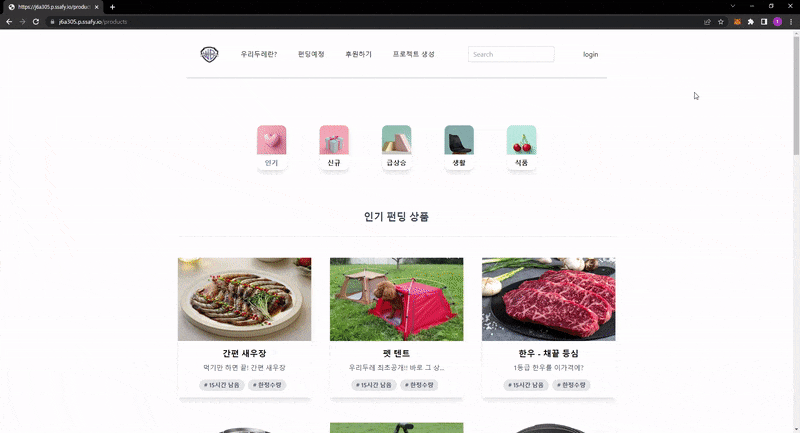
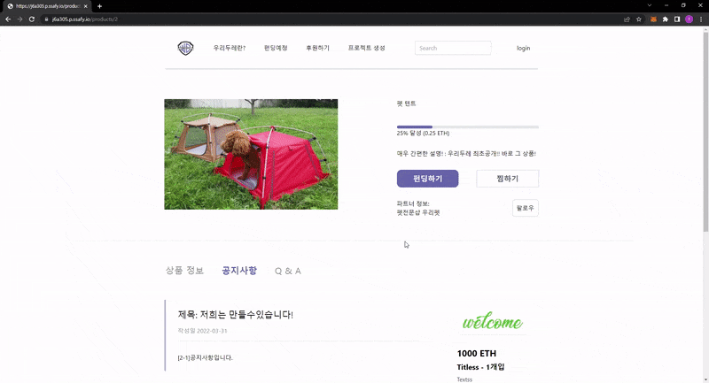
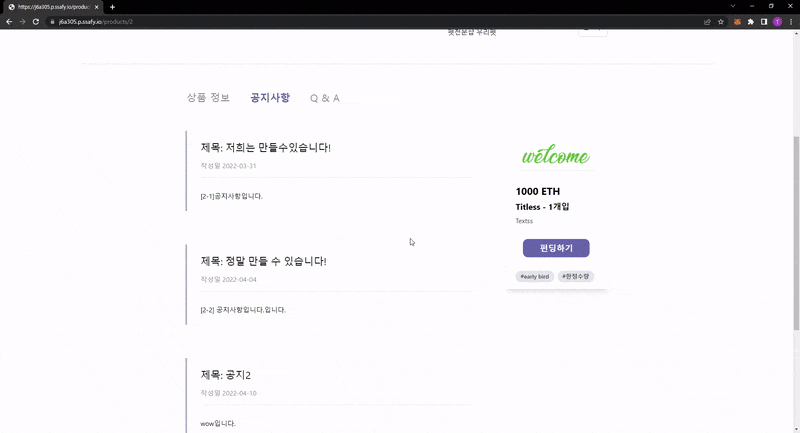
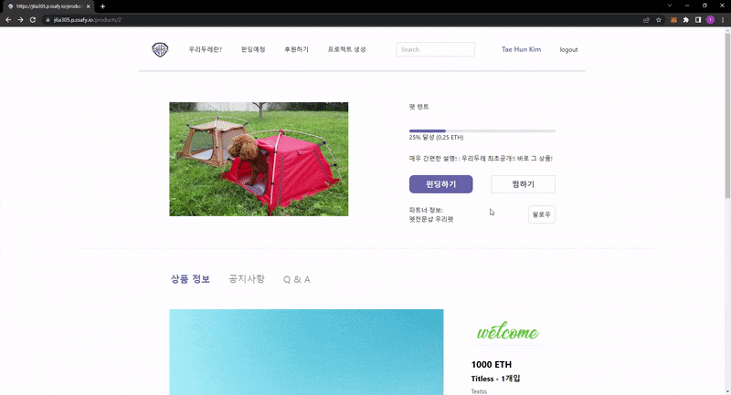
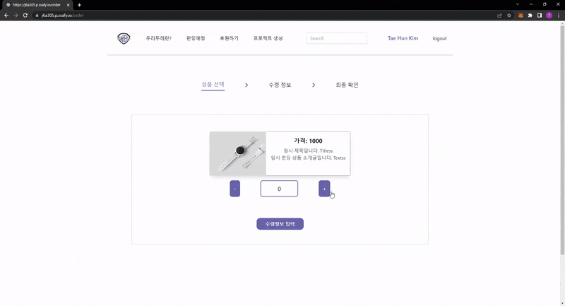
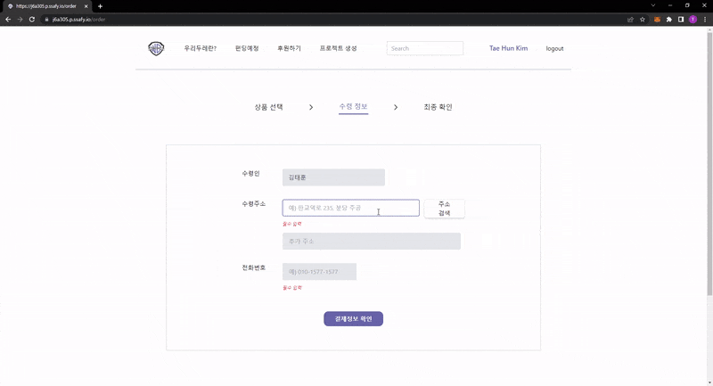
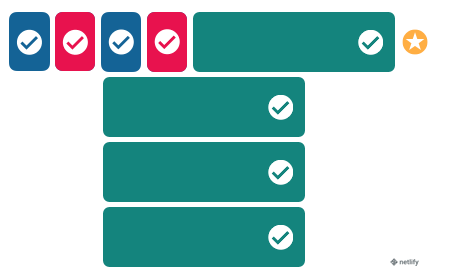

1. Tae Hun's readme

   <hr>


   目次:

   - [詳細貢献事項](#詳細貢献事項)
   - [向き合ったトラブル](#向き合ったトラブル)
   - [今後の改善案](#今後の改善案)
   - [初チームプロジェクトの感想](#初チームプロジェクトの感想)

   <br>

   <br>

   ### 詳細貢献事項

- ファンディングページ 担当

  - ファンディングのカテゴリの`navbar`提供

  - ファンディング詳細ページに移動するファンディング商品カードを提供

    

   <br>
  
- ファンディング詳細ページ担当

  - ファンディング商品の詳細情報提供&当該ファンディング商品のオプション提供

    

  

  - 当該ファンディングに関するお知らせの作成及び照会

    

  

  - 当該ファンディングに関するQnA生成及び照会

    

  - お知らせとQnA生成のためのモダルウィンドウの提供

  <br>

 - 決済ページ担当

   - 決済プロセス`navbar`提供

   - 受取人情報入力`component`の提供

     

     

   - 受取人住所入力ウィンドウ：`Daum`の郵便番号サービス`api`と連動してモダルウィンドウで提供

   - 電話番号入力ウィンドウで自動`-`入力提供

     

   - 選択されたファンディング商品オプション及び受取人情報のステート情報管理

   - ファンディングの最終確認段階で選択されたファンディング商品情報を反映

   <br>

 - ユーザーのステート情報管理およびログインページ(OAuthロジックを除く)担当

   - プラットフォーム別のOAuthログイン指針に応じたログインページを提供
   - ページが更新されるたびにログインステート情報の確認および変更点を反映するロジックを提供

   <br>

   <br>

   ### 向き合ったトラブル

   1. <u>非同期作業によるステート情報管理のトラブル</u>  : ユーザー情報ステート管理で発生した問題

      - ```JSX
        // [ setUserSeq 関数で userSeqのステートが反映される前に if文に入ってしまい setIsLoggedIn 関数が実行されない問題 ]
        const [userSeq, setUserSeq] = useState('');
        
        const getUserInfo = async () => {
            const data = await fetch('https://j6a305.p.ssafy.io/api/user/check');
            try {
                const temp = await data.json();
                console.log('JSON　ユーザー情報: ', temp);
                await setUserSeq(temp.userSeq);
                await setUserInfo(temp);
                if (userSeq) {						// 問題の　if文
                  setIsLoggedIn(true);
                }
            } catch {
                console.log('사용자가 아닙니다');
            }
          }
        ```

        ```JSX
        // [ callback 関数で, 関数実行順序を定義してもよさそうでしたが、可読性が落ちると思いました。 ]
        ...
        	setUserSeq(temp.userSeq, function () {
                if (userSeq) {
                  setIsLoggedIn(true);
                }
        	})
        ...
        ```

        ```JSX
        // [ 結論的に if文のconditionを、そもそもfetchしてもらってくるtempの情報に変更して解決しました。 ]
        ...
            if (temp.userSeq) {
                  setIsLoggedIn(true);
                }
        ...
        ```

        

      <br>

      <br>

   ### 今後の改善案

   1. ビルド時にdynamicに生成する「詳細ファンディングページ」の数を制限し、ビルド時間短縮およびUX維持

      - ```JSX
        // [ 本来は生成する「詳細ファンディングページ」の数が少なく、すべてのdynamicpathsをビルド時に生成しました。 ]
        
        export const getStaticPaths = async () => {
          const res = await fetch('https://j6a305.p.ssafy.io/api/funding/lists/1', {"sort": 1});    // ファンディングリストの　getリクエスト
          const data = await res.json();
        
          const paths = data.data.map(fund => {
            return {
              params: {id: fund.fundingSeq.toString()}	// ルーティングに使うidをreturn([id].jsとkeyの名前が同一である必要がある)
            }
          })
        
          return {
            paths: paths,     // keyの名前がpathsであることはconventionで、それは下のgetStaticPropsのcontextに自動的に伝達されます。
            fallback: false,  // 無効なid値のページにルーティングされると自動的に404ページを表示 
          }
        }
        ```

      - ```JSX
        // [ しかし今後数百個のファンディング商品ページのdynamicpathsを全部ビルド時staticsitegenerationするのは、ビルド時間が増えてCD/CIに悪影響があると思いました。 ]
        
        // [ なので以下のように、'getStaticPropsfallback:true'を活用して一定個数だけビルド時にdynamicpathsを生成することでDXを改善し、UXも維持するためにビルド時に生成されていないdynamicpathsはクリックするたびにdynamicpathsを生成+リアクトの'Suspense'を活用してページローディング時に用意されたローディングページを見せればよいと考えました。 ]
        export const getStaticPaths = async () => {
            ...
            return {
                paths: paths,
                fallback: true,
            }
        }
        
        const Detail = ({fund, fundingSeq}) => {
            ...
            return (
            	...
                <Suspense fallback={<Loader />}>
                	<ProductQNA fundingSeq={fundingSeq} />
                </Suspense>
                ...
            )
        }
        ```
        
      
      <br>
      
   2. ステートライブラリを活用して乱雑だったステート管理の改善
   
      - シンプルにステート管理がとても乱雑でした。
   
        コードの可読性、再使用性、非同期作業ロジックの直観性、デバッグ環境の改善などのためにmodulardesignを勉強しながら開発を進めました。
   
        しかし、propsdrilling現象があまりにも頻繁に起こり、ステート情報の移動過程が複雑になるほど頻繁なヒューマンエラーがあり、可読性も低下しました。
   
      - 今度は、Reduxのようなステート管理ライブラリを活用してmodulardesignを遵守するとともに、よりクリーンなステート管理を実現できれば、modulardesignの長所を持つとともに、コードの可読性、デバッグ環境の改善など、DX的な面で改善の余地が多いのではないかと考えました。
   
      - また、グローバルステート情報の管理方法は、開発に入る前に確立すべきであることを痛感しました。
   
        そうすればチーム同士でステート情報のcollisionが予防できて、コードのテストもすぐにできて、より円滑な開発ができると思いました。
   
      <br>
   
   3. 新しいファンディング登録時にリアルタイム反映機能を追加
   
      - 仕上げの段階でテストをしていたところ、生成したファンディングがリアルタイムで反映されない問題を発見しました。
      
        当然なことに、私は早いページロードのためにファンディング商品情報をビルド時にだけ呼び出してstaticpageを作ったからです。
      
        つまり、新しいファンド商品を反映するためには、front-endをrebuildする必要がありました。
      
        これに対する解決策としてIncrementalSiteRegeneration(ISR)あるいはSSRキャッシュを活用して解決できると考えました。
   
      - Incremental Site Regeneration (hybrid render)
      
        - これは指定した周期でServer-side-renderingを行い、新たにupdateされたファンディング商品をfront-endに反映するnext.jsの比較的最新機能です。
      
        - しかし、これも完璧な対策ではないと思います。
          ISRは以下のように、「atomic and immutable」配布の構造を崩します。 
          
      
          これはキャッシュされたページのバージョンの一貫性を壊すため、他バージョンのデータを持つページにルーティングされるなど、想定外のバグが発生する余地が生じます。
      
          また、このような問題はデバッグの際にも生じますが、開発者と問題を抱えているユーザーが同じバージョンのキャッシュされたページを眺めていない可能性が生まれます。
      
          <u>結論としてISRも生成したファンディングをリアルタイムで反映させることができる完璧な解決策ではないと思います。</u>. [参考](https://www.netlify.com/blog/2021/03/08/incremental-static-regeneration-its-benefits-and-its-flaws/)
      
      - Stale-While-Revalidateを活用したSSRcaching
      
        - もう一つの対案はStale-While-Revalidateを活用したSSRcachingです。
      
          この方法は以下の構造のように、ページの最新化が必要になったら、先にキャッシングされた以前のバージョンの情報を表示して、最新化が終わる次第ページを最新化させます。. [参考](https://www.toptal.com/react-hooks/stale-while-revalidate#:~:text=.-,How,Works,-When%20a%20request)
          
      
          これは通常のSSRのようにページの最新化になるまで画面が止まることも、リロードをしてこそ最新化が適用されないため、UX改善が期待できる方法です。
      
          <u>しかし、この方法もSSRの問題点である「ページ情報を最新化するまでに時間がかかる」を抱えています。.</u>
      
        <br>
      
   
   <br>
   
   ## 初チームプロジェクトの感想
   
   - 知らないことだらけでした。
     フロントエンドのプロジェクト構造はどのように構成すべきか、チームメンバーとはどのように協力すべきか、コードはどのように書くべきかなど、はてなだらけであって、結構大変でした。ハハ。
   - そんな中、なんとかプロジェクトの最終日を迎えて、終わったプロジェクトを見ていると気分が満ち足りていました。 その理由はプロジェクト過程で多くのことを学び、結果物を通じてより多くの学びがあったからです。 何と言うか、ウェブ開発の専門家にもう一歩近づいた気分とも言えるでしょうか。おまけに共に成長する仲間ができたことも嬉しいところです。
   - 最後に、今回のプロジェクトをきっかけに私は確実にユーザーの使用性改善に興味があることを自覚しました。おかげさまでこれからはフロントエンドを中心に勉強することを決めました。 これからが楽しみです。
