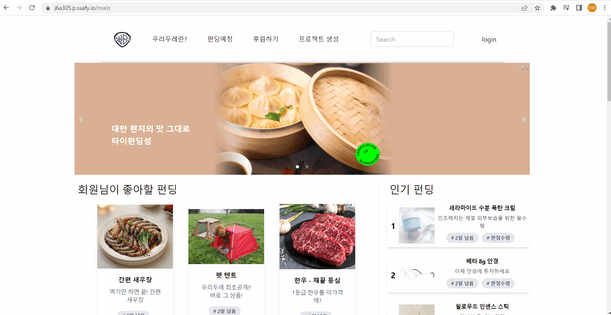

# Woori Doore

## プロジェクト紹介：

「WOORIDOORE」は既存の各種プラットフォームを通じて行われていた共同購入、小規模ファンディングでの様々な問題を解決するために考案しました。 ファンディング主催者およびファンディングプラットフォームに対する信頼性を確保するためのブロックチェーンを使用したファンディングプラットフォーム「WOORIDOORE」、よろしくお願いします。

- [**キムテフンの担当内容READMEはこちらです**](https://github.com/SPlCYWOLF/Portfolio/tree/master/우리두레/docs/キムテフン)

---

## 技術スタック

### **Frontend**

### **Backend**

### **DevOps**

### **Co-tool**

---

 

 ### ホームページ１

 

### ホームページ2

 

### ログイン画面

 

### ページの紹介

